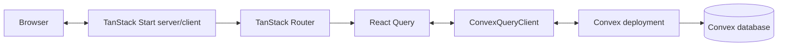
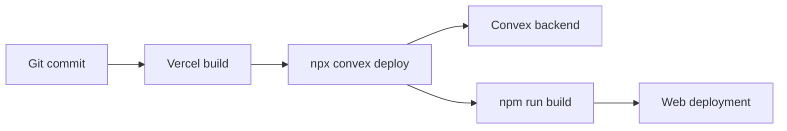

# System overview

[Architecture index](README.md) · [Wiki home](../README.md)

## Runtime shape

TanStack Start renders the React application and owns file-based routing. `getRouter()` creates a React Query client, connects it to `ConvexQueryClient`, and wraps the route tree in `ConvexProvider`. Components then use generated Convex references for typed reads and writes.

## Source-to-runtime boundaries

| Boundary             | Source                                       | Responsibility                                                                            |
| -------------------- | -------------------------------------------- | ----------------------------------------------------------------------------------------- |
| Build/runtime        | `vite.config.ts`                             | Composes Tailwind, path aliases, TanStack Start, Nitro, and React; dev port is 3000.      |
| Router and providers | `src/router.tsx`                             | Creates the router, React Query cache, Convex client, preload policy, and default errors. |
| Root document        | `src/routes/__root.tsx`                      | Defines HTML shell, global metadata/assets, stylesheet, scripts, and route outlet.        |
| Route UI             | `src/routes/*.tsx`                           | Defines URL-addressable components and route-specific data use.                           |
| Backend              | `convex/*.ts`                                | Defines database schema and server queries, mutations, and actions.                       |
| Generated contracts  | `src/routeTree.gen.ts`, `convex/_generated/` | Carries generated route and backend types; never hand-edited.                             |

## Current request paths

### Michigan personnel explorer

1. A browser requests `/`.
2. The client-rendered index route makes one bounded `rosters.list` read for active players and paints the current depth chart.
3. A commitment read plus position-specific departed reads hydrate in the background to work around the hosted function's 200-row cap, then the client deduplicates all 428 roster entries by player ID.
4. Up to 12 concurrent `players.getProfile` reads progressively add recruiting, career, seasonal, movement, and draft details as players are discovered.
5. `seasonalStats.listBySeason` reads one bounded 2015–2025 season and merges participants with zero-snap roster players.
6. Search and the six views derive from the typed records without a separate REST layer or client data copy.

### Roster administration

1. A browser requests `/admin/roster` and reads the same bounded active roster plus the bounded canonical-program list.
2. The owner chooses Edit, Add, or Remove and keeps the deployment key only in the page's React state.
3. The selected `rosterAdmin` mutation verifies that key against the target Convex environment before reading data.
4. `updatePlayer` changes current stint facts; `addPlayer` creates a complete normalized identity/profile/stint/summary/arrival lifecycle; `removePlayer` closes the stint and adds a departure without deleting history.
5. Reactive public roster reads propagate the resulting active-roster and football-fact changes back to both routes.

## Build and deployment path

`vercel.json` selects the `tanstack-start` framework preset and defines `npx convex deploy --cmd 'npm run build'`. The deployment needs credentials for the selected Convex project and must expose the resulting Convex URL to the web build. Nitro packages the web application for the Vercel runtime.

Development has the prior 19-table percentile-composite model and the earlier roster-update function. Checked-in source adds the roster arrival/departure functions plus the 21-table immutable Power/Résumé edition contract, but both remain pending an authorized development push; production remains on the prior 17-table/function foundation until explicit promotion. The owner-confirmed Vercel project is `cfb`, and its production URL is `https://cfb-hazel.vercel.app`. A production redeploy containing the Nitro configuration and a successful smoke test are still required before the hosted web pipeline is considered verified.

## Deliberate boundaries

- There is no separate REST or Express server. Convex is the data/backend boundary.
- There is no identity provider, user session, or roles layer. Three narrowly scoped roster mutations use the deployment-secret authorization in [ADR 0005](../decisions/0005-single-owner-roster-admin-key.md).
- There is no HTTP route module under `convex/http.ts`.
- There is no separate design-system package, test package, monorepo, or shared library.
- There is no service worker or offline data layer beyond the generated web manifest.

Introduce a new boundary only when a product requirement cannot be served cleanly by the current stack, and record durable choices in an ADR.
