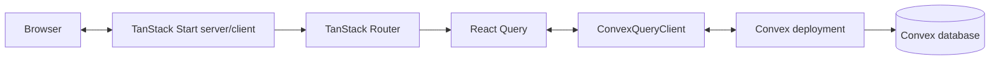
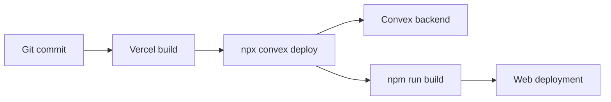

# System overview

[Architecture index](README.md) · [Wiki home](../README.md)

## Runtime shape

TanStack Start renders the React application and owns file-based routing. `getRouter()` creates a React Query client, connects it to `ConvexQueryClient`, and wraps the route tree in `ConvexProvider`. Components then use generated Convex references for typed reads and writes.

## Source-to-runtime boundaries

| Boundary             | Source                                       | Responsibility                                                                            |
| -------------------- | -------------------------------------------- | ----------------------------------------------------------------------------------------- |
| Build/runtime        | `vite.config.ts`                             | Composes Tailwind, path aliases, TanStack Start, and React plugins; dev port is 3000.     |
| Router and providers | `src/router.tsx`                             | Creates the router, React Query cache, Convex client, preload policy, and default errors. |
| Root document        | `src/routes/__root.tsx`                      | Defines HTML shell, global metadata/assets, stylesheet, scripts, and route outlet.        |
| Route UI             | `src/routes/*.tsx`                           | Defines URL-addressable components and route-specific data use.                           |
| Backend              | `convex/*.ts`                                | Defines database schema and server queries, mutations, and actions.                       |
| Generated contracts  | `src/routeTree.gen.ts`, `convex/_generated/` | Carries generated route and backend types; never hand-edited.                             |

## Current request paths

### Splash page

1. A browser requests `/`.
2. TanStack Start renders the root document and index route.
3. The route renders static React/Tailwind markup; it does not invoke a Convex function.
4. The router still constructs a Convex client, so a valid `VITE_CONVEX_URL` remains part of runtime configuration.

### Sample data page

1. A browser requests `/anotherPage`.
2. The component creates `convexQuery(api.myFunctions.listNumbers, { count: 10 })`.
3. React Query delegates the request and cache key to `ConvexQueryClient`.
4. Convex executes `listNumbers`, reads at most ten `numbers` documents, and streams updates back to subscribers.
5. The button calls `myAction`; that action reads recent numbers and invokes `addNumber` to insert a new value.

## Build and deployment path

`vercel.json` defines `npx convex deploy --cmd 'npm run build'`. The deployment needs credentials for the selected Convex project and must expose the resulting Convex URL to the web build. No Vercel project identifier or production URL is stored in the repository today.

## Deliberate boundaries

- There is no separate REST or Express server. Convex is the data/backend boundary.
- There is no authentication provider or authorization layer.
- There is no HTTP route module under `convex/http.ts`.
- There is no separate design-system package, test package, monorepo, or shared library.
- There is no service worker or offline data layer beyond the generated web manifest.

Introduce a new boundary only when a product requirement cannot be served cleanly by the current stack, and record durable choices in an ADR.
