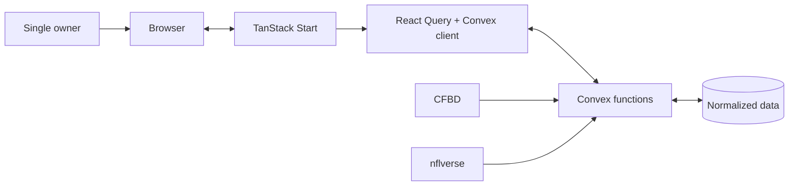

# System overview

[Architecture index](README.md) · [Wiki home](../README.md)

## Runtime shape

TanStack Start owns routing and rendering. Convex owns validation, transactions, external synchronization, immutable publications, and real-time reads. There is no separate REST server.

## Request paths

### Public exploration

1. `/` requests one bounded Michigan season dashboard and only fetches profiles/comparisons/grade/NFL detail needed by the selected view.
2. `/games` requests one season/week edition dashboard; Résumé/SOS/playoff/team/matchup/ballot detail is loaded for its active tab.
3. All evidence is normalized server-side. Historical views select stored edition cutoffs rather than recomputing with future facts.

### Owner workflow

1. `/admin/roster` exchanges `CFB26_ADMIN_KEY` for a random token. Only its hash, expiry, and revocation state are stored server-side.
2. The UI sends the token to bounded owner queries and mutations.
3. Player lifecycle, annual records, games, grades, identities, and gaps write transactionally.
4. Imports and rollovers require a dry run/preview; import, rollover, merge, and delete require a verified backup manifest.
5. Reactive public reads receive committed changes without a separate data copy.

### Source synchronization

1. Direct CFBD/nflverse actions mark their source running.
2. Valid rows upsert in bounded batches under stable keys; unresolved identities never create guessed people.
3. Success records counts and freshness. Failure records the error and retains the last valid data.
4. Edition publication checks core source readiness; optional enrichment may degrade without blocking.

## Build/deployment

`vercel.json` runs `npx convex deploy --cmd 'npm run build'`; Nitro packages the TanStack app. Source currently defines 41 tables and has not been synchronized to either recorded deployment. Any schema/data cutover follows the exact-target [deployment and migration runbook](../guides/deployment.md), development first.

## Deliberate boundaries

- Michigan is the only college player archive; NFL rows are retained only for confirmed Michigan alumni.
- Direct source data and owner facts are separated from CFB26-derived editions.
- Raw provider responses, play-by-play, and import payloads are transient.
- Owner sessions are single-principal access, not a social/multi-role account system.
- There is no public data API, betting layer, notification system, or native app.
