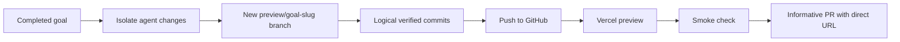

# Preview pull requests

[Guides index](README.md) · [Wiki home](../README.md)

The repository's [`$preview-pr`](../../../.agents/skills/preview-pr/SKILL.md) workflow turns one completed agent goal into a new review branch, logical commits, a Vercel preview, and a GitHub pull request with enough evidence for a reviewer to evaluate it.

## When to use it

Use the workflow only when the user explicitly asks to publish the current agent's completed changes as a preview branch or preview PR. Ordinary requests to verify, summarize, commit locally, review a PR, merge, or deploy production do not authorize the flow.

The authorization covers one new branch, goal-scoped commits, one push, the resulting preview deployment, and one PR. It never covers merge, production promotion, force-push, repository settings, or unrelated working-tree changes.

## Prerequisites

- The implementation goal is complete and its change set can be distinguished from unrelated work.
- `origin` points to the intended GitHub repository.
- GitHub CLI is authenticated with repository write access.
- The repository has a Vercel GitHub integration that deploys preview branches or PRs.
- Required local checks pass.
- Convex backend changes have been validated against the intended non-production deployment when one is available.

The repository records the owner-confirmed Vercel project and production domain, but a preview run must still resolve and smoke-test its own commit-specific deployment URL.

## Lifecycle



1. Resolve the remote default branch and exact goal-owned diff, excluding older local commits unless they are accepted prerequisites.
2. Create a unique `preview/<goal-slug>` branch without rewriting the base branch.
3. Group changes into reviewable Conventional Commit-shaped chunks.
4. Run the repository quality gate on final `HEAD` and push without force.
5. Find the Vercel GitHub deployment for the exact pushed SHA.
6. Smoke-test the direct preview URL.
7. Create a ready PR—or update a fallback draft—with goal, changes, commits, checks, preview, risk, documentation, and follow-ups.

See the skill's [commit and PR format](../../../.agents/skills/preview-pr/references/commit-and-pr-format.md) for naming rules and the body template.

## Preview discovery

The skill includes a read-only helper that checks GitHub deployment records for a Vercel preview matching the full commit SHA:

```powershell
npm run preview:find -- dreamsbydutch/cfb26 <full-sha>
```

Treat the JSON `state` as the canonical result; package runners may normalize a child process's nonzero exit code.

| State                      | Next action                                                              |
| -------------------------- | ------------------------------------------------------------------------ |
| `success`                  | Smoke-test `environmentUrl` and add it to the PR.                        |
| `not_found` or `pending`   | Poll in short rounds for at most five minutes.                           |
| `failed` or `lookup_error` | Keep the branch, preserve a draft PR if present, and report the blocker. |

The helper rejects Vercel dashboard hosts as preview URLs. A valid PR link must open the rendered application over HTTPS. Smoke verification checks the changed routes and states; deployment protection remains a reported blocker unless an already-authorized browser session can access it.

## Draft fallback

Some Vercel integrations wait for a pull-request event. If branch push produces no deployment within 60–90 seconds, the skill may create one draft PR with “Preview provisioning” in its Preview section. It then continues polling, edits that same PR with the direct URL, and marks it ready only after deployment success and a smoke check.

If deployment fails or times out, the PR remains draft and states the exact blocker. The flow must not fabricate a URL or claim readiness.

## Logical commits

Commits use `<type>(<scope>): <imperative outcome>` and are grouped by independently reviewable/revertible outcomes. Source stays with required generated contracts/tests, and command behavior stays with its documentation. Every staged diff is inspected for secrets, build output, and unrelated user files.

## Successful handoff

The final response includes:

- `preview/*` branch and ordered commit list.
- Final pushed SHA and checks executed.
- Direct Vercel preview URL and smoke-tested routes/states.
- GitHub PR URL and base/head branches.
- Explicit confirmation that the PR is unmerged and production was untouched.

If any of those cannot be proven, report the flow as blocked or partially complete rather than successful.
